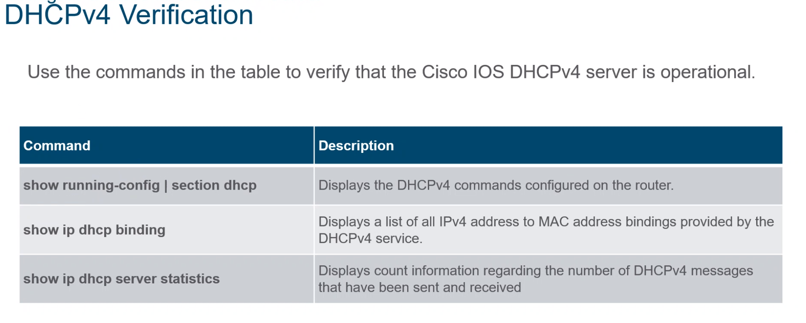

 # **Controller based Access Point:**

alle Access Points bauen eine Verbindung zum Controller auf und man kommuniziert mit dem Controller, welcher es zu den Access Points weiterleitet. Der Controller weiß alles. End User verschlüsselt etwas, Controller entschlüsselt es mit dem Key.
Authentisierung: 802.1x  -> Schulnetz: PEAP  -> Phase 2 Authentifizierung Unterkategorie: 
MS-CHAP v2
# **IETF (Internet Network Taskforce)**

Standardisiert die ab Layer 3 (und aufsteigenden) Technologien (IP, TCP, UDP, http, etc)
# **IEEE** 
Standardisiert die Technologien von Layer 1 und 2 (Switches, Ethernet, etc)

## **802.1x**
3 Teile: (Software) Supplicant  ->   Authenticator  -> Authe. Server
Supplicant = Software am Endgerät
Authenticator = wie ein Schalter, der die Verbindung durchlässt oder nicht (wenn wireless: Access Point/Controller, wenn kabelgebunden: Switch)

  ## **1. 802.3 Ethernet**
802.3  -> IEEE Standard für Ethernet

 ## **2. 802.3x**
Flow Control bei Ethernet (backpressure  ->simuliert Collisions)

# **Unknown Unicast:**
Wenn ein Unicast Frame an einen Switch gesendet wird und die destination MAC-Adresse noch nicht im Switching Table vorhanden ist, wird der Frame an alle Ports geschickt, außer an den Port, der den Frame erhalten hat. 

# **Switches/Router:**
4 Speicherarten: 

- ROM  -> Read only memory, BIOS

- RAM  -> logisch, Routing Table wird darin gespeichert

- NVRAM  ->Non volatile RAM  -> Speicher wird beim Ausschalten nicht geleert, beinhaltet die startup-config

- Flash  -> VLAN database, Operating System

 # **Domäne:**
hub.spengergasse.com

FQDN = Fully Qualified Domain Name -> besteht aus hostname + domainname zB hub.spengergasse.at
  ## **1. Domainname:**
spengergasse.at

„spengergasse“  -> Secondary Level Domain (SLD)  

„com“/“net“/“org“  -> Top Level Domain 
(TLD) ODER „at“/“de“  -> Country Code (CC)
  ## **2. Hostname:**
hub, moodle, www, cloud, etc
  # **Localhost:**
127.0.0.0  
Ein Netz, welches nur am eigenen Gerät existiert. Wird verwendet um den TCP/IP Stack zu simulieren.
  # **Standardports:**
- HTTP  -> :80

- HTTPS  -> 443

- SSH  -> :22

- DHCP  -> 67, 68 (Server und Client)

# **DNS:**

Resource Records (RR):

- A -> gibt den Namen einer IPv4 Adresse an 

- PTR -> gibt die IPv4 Adresse eines Domainnamen an

- MX -> findet zuständigen Mailserver der Domain

- AAAA -> wandelt Name in IPv6 Adresse um

- NS -> gibt den Nameserver zur Domain an

# **Routing:**
Router sind eine Technologie auf Layer 3 und werden dafür benutzt, um zwischen IP-Netzwerken zu kommunizieren. Alle Technologien, die unter Layer 3 operieren, haben NICHTS mit anderen Netzwerken zu tun, sie simulieren höchstens Subnetze (VLANs).

Die Routing Table wird im RAM gespeichert.
  ## **1. Static Routing:**
Man gibt dem Router an, dass alle Pakete, die an ein bestimmtes Netz gehen sollen, über einen bestimmten Next Hop weitergeschickt werden sollen.

Syntax: ip route [Destination IP] [Destination Subnet Mask] [Next Hop IP]
  ## **2. Default Routing:**
Der Router sendet alle Pakete, von denen er keine Ahnung hat, wo er sie hinschicken soll (alle Pakete, deren Netzwerke nicht im Routing Table vorhanden sind) bei einem bestimmten Port raus oder an einen bestimmten Next Hop.

Syntax: ip route 0.0.0.0 0.0.0.0 [Next Hop IP/Port]
  ## **3. Dynamic Routing:**
Mit Hilfe von Algorithmen und Protokollen wird das Routing automatisch durchgeführt. Ist am komplexesten aber auch am weitesten verbreitet.
  # **IPv6 (RFC 8200):**
IETF Standard: RFC 8200

 - 128 Bits lang

 - Eine IPv6-Adresse ist unterteilt in Netz- und Hostanteil  

 - Prefix-length ist meistens /64 (oder /128, wenn man eine bestimmte Adresse in einem bestimmten Netz will) 

 - Die Netzadresse kann im IPv6 normal vergeben werden

  - Es gibt UC (Unicast), MC (Multicast) und AC (Anycast)

 - Aufeinanderfolgende 0 können mit :: abgekürzt werden zB 2001::1/64 = 2001:0:0:0:0:0:0:1/64

**Verschiedene wichtige IPv6-Adressen:**  
- Global Unicast:	2001:xxxx  
- Link-local:	FE80:xxxx/64  
- Multicast:	FFxx:xxxx (meistens FF02:xxxx)  
- Localhost:	::1/128  
- Unspecified:	::/0

  ## **1. Anycast:**
es kann (durch entsprechende Konfiguration) mehrere Geräte mit derselben Adresse geben, bei Anycast entscheidet das Routing Protokoll den nächsten Server und verbindet den.  -> Beispiel: einem ist egal, welchen Server man will, man möchte den der am schnellsten erreichbar ist. **Failover:** wenn man die Verbindung zum Server verliert (Server down, etc) wird man gleich zum nächstbesten weitergeleitet.
  ## **2. Global Unicast:**
Beginnen mit 2001:xxxx:xxxx:xxxx
Wenn 2001:DB8:xxxx:xxxx  -> reservierte Adresse für experimentieren
  ## **3. Link-Local:**
Beginnt mit FE80:
ist dafür da, dass das Gerät **immer** eine IP bekommt, selbst wenn der DHCP Server unerreichbar. Link-local ist **nicht einmalig**. Gilt nur im Segment bis zum Router.
  ### **3.1. EUI-64:**
Eine Methode, den Hostanteil einer link-local Adresse zu generieren. Man nimmt die MAC-Adresse, und gibt in die Mitte (also nach den ersten 24-Bits) FF:FE.

Außerdem wird der 7. Bit invertiert (0  -> 1, 1  -> 0).

MAC: 00:00:00:00:00:00  -> 00:00:00FF:FE00:00:00  -> 00000010:00:00FF:FE00:00:00  -> 0200:00FF:FE00:0001  -> **Host-Teil der Link-Local: 200:FF:FE00:1** 

  ## **4. Multicast:**
FFxx:xxxx (meistens FF02:xxxx)
FF02::1  -> any host in network
FF02::2  -> any router in network 
  
  # **IPv4 (RFC 791):**
IETF Standard: RFC 791

VLSM = Variable Length Subnet Mask

Entwicklung:

- Von Classful auf Classless
- Private IP-Adressen Zuteilung (RFC 1918)
- NAT 

Mithilfe der drei Technologien wurden viele IP-Adressen gespart (sonst wären sie viel zu schnell ausgegangen).

  ### **1. Classful:**
  ### **2. Unicast:**
A: 0-127 (0xxxxxxx.) (/8)  
B: 128-191 (10xxxxxx.) (/16)  
C: 192 – 223 (110xxxxx.) (/24)

  ### **3. Multicast:**
D: 224 – 239 (1110xxxx.)
  ### **4. Experimental:**
E: 240 – 255 (111xxxxx).
  ### **5. Classless:**

  ## **ARP (Address Resolution Protocol):**
ARP wird verwendet, um zu einer IPv4 Adresse die zugehörige MAC-Adresse zu finden. Man kann also mit einem ARP-Request herausfinden, welches Gerät welche IPv4 Adresse hat. Dies wird z.B. bei APIPA verwendet.
  ## **ARP (Address Resolution Protocol):**
Wenn kein DHCP Server erreicht werden kann, dann gibt sich der Client automatisch eine IP-Adresse aus dem Netz 169.254.0.0/16

  # **VLAN:**
Ein VLAN ist ein Konzept auf dem Layer 2 (Switching). Es entspricht im Layer 3 einem Subnetz.
**Ein VLAN ist eine Broadcast-Domain.**

Vorteile: 

- Reduziert Kosten (man kann an einen Switch mehrere VLANs anschließen)
- Man kann alles in der Software konfigurieren
- Verbessert die IT-Effizienz

Vlan1 = default. Name kann nicht geändert werden.

Es gibt 5 VLANs die man nicht löschen kann: VLAN1, VLAN1002, VLAN1003, VLAN1004, VLAN1005

VLAN 1002-1005 sind mittlerweile unsupported und wurden früher benutzt. 

Am Switch können vlan infos mit show vlan (brief) angezeigt werden.
  ## **VTY:**
Virtual Teletype  -> eine virtuelle Line (Connection Möglichkeit) um sich an einen Switch zu verbinden. Somit kann man den Switch konfigurieren, ohne eine physische Verbindung herzustellen (virtuelle Verbindungen). Am Switch selbst: line vty 0  
Es gibt 16 VTY Lines (0-15). Sprich es können sich maximal 16 Leute mit dem Switch verbinden.
  ## **SVI:**
Switched Virtual Interface  -> ein virtuelles Interface auf einem Layer 2 Switch. Switch Ports können normalerweise KEINE IP-Adressen zugewiesen bekommen, aber das SVI kann eines zugewiesen bekommen. 
Z. B.: interface vlan 1
  ## **QoS:**
Quality of Service  -> vier Grundlagen, die man immer erreichen will: Bandwith, Delay, Jitter (Varianz in Delay  -> einmal schnell, plötzlich langsam, dann wieder schnell etc), Packet Loss.
  ## **Voice VLAN:**
ein seperates VLAN wird für Voice VLAN benötigt, weil Voice Traffic eine gute Bandbreite, hohe QoS Priorität, Möglichkeit Verstopfungen zu avoiden und kleinen Delay benötigt.
  ## **Trunk**
Man kann verschiedene Switch ports in die verschiedenen VLANs (Broadcast Domains) geben. Wenn man einen Port aber in zwei Broadcast Domain gleichzeitig gibt, nennt man das „Trunk“. Wenn man einen Port als Trunk einstellt, wird er automatisch auf alle VLANs eingestellt. Man kann jedoch im Nachhinein sagen, welche VLANs davon allowed sind, sprich welche ignoriert werden.
  ## **IEEE 802.1q**
IEEE regulierte Standards für Trunk-Tagging. Getaggte Frames findet man nur am Trunk-Port.
  ## **Native VLAN:**
Selbst Frames von Trunk-Ports werden untagged übertragen. Dies geschieht aufgrund von Rückwärtskompatibilität von alten Geräten, welche VLANs noch nicht unterstützen. Standardmäßig ist VLAN1 das native VLAN. Beide Enden eines Trunk-Links müssen mit dem gleichen native VLAN eingerichtet sein. Sonst kann es passieren, dass ein Frame ohne einen Router von einem VLAN ins nächste springt, was nicht passieren darf.
  ## **Voice VLAN Tagging:**
Das VoIP Telefon ist ein three port switch:

- Der Switch benutzt CDP um das Telefon von Voice VLAN zu informieren
- Das Telefon tagged seinen eigenen traffic (Voice) und kann Class of Service (CoS) setzen. CoS ist [QoS](#_QoS:) für Layer 2
- The phone may or may not tag frames from the PC.

Wenn zB das VLAN 150 für Voice gedacht ist und noch ein Kabel weiter zu einem PC führt, der für VLAN 20 gedacht ist, nimmt das Phone alle Frames mit dem Tag für 150 und leitet alle Frames an VLAN 20 an den PC weiter (und nimmt das Tagging davor weg). 
QoS is managed unfairness  ->Voice VLAN wird priorisiert, da es Zeitkritisch ist. [QoS](#_QoS:) ist aber KEIN Weg, um mehr Bandbreite zu bekommen.
  ## **VLAN Ranges auf Catalyst Switches:**
Normal Range VLANS: 1-1005, wobei VLAN 1002-1005 automatisch erstellt und reserviert werden und nicht gelöscht und umbenannt werden können (für alte Technologien).

Extended Range VLAN: 1006 – 4095
  ## **VLAN Speicherort**
Die VLAN Informationen sind in einer VLAN Database gespeichert, welche nicht im NVRAM liegt, sondern im Flash. Sprich wenn man erase startup-config macht, werden zwar die ganzen Informationen gelöscht, jedoch nicht die ganzen VLAN Informationen.
  ## **VLAN Configuration in der IOS:**

Wenn kein VLAN Name angegeben wird, benennt die Cisco IOS das VLAN automatisch nach der ID, z.B.   VLAN ID: 20  -> default VLAN Name: vlan0020
  # **DTP:**

Dynamic Trunking Protocol, erlaubt Verhandlungen zwischen Switchports, um den mode vom gegenübeliegenden Switchport zu ändern

  ## **Inter-VLAN Routing:**
Mithilfe von Layer 3 Switches (Mischung aus Switch und Router).

Inter-Vlan Routing ist der Prozess vom Datenaustausch zwischen zwei VLANs über die Routing Instanz.
  ### **Legacy Inter-VLAN Routing:**
Der Router benötigt so viele physische Interfaces, wie man VLANs haben möchte. Legacy Inter-VLAN Routing ist outdated und wird nicht mehr verwendet.
  ### **Router-on-a-Stick Inter-VLAN Routing:**
Der Router hängt mit einem einzigen Kabel an dem Switch, nicht wie bei Legacy für jedes VLAN ein Interface.

Benutzt **Subinterfaces** ( -> ein Interface, welches logisch in mehrere Subinterfaces für jedes VLAN unterteilt wird. **Jedem Subinterface wird eine IP-Adresse gegeben**)
  ### **Inter-VLAN Routing on a Layer 3 Switch:**
Benutzt Layer 3 Switches, die [virtuelle Interfaces (SVIs)](#_SVI:) anlegen. Diese Interfaces sind auf Layer 3. 
Vorteile davon sind:

  ## **Layer 3 Switch:**
Werden auch Multilayer Switches genannt. Eigentlich sind sie normale Layer 2 Switches, jedoch wurde ihnen über Software beigebracht, auf Layer 3 zu arbeiten. Die Layer 3 Funktionen müssen jedoch zuerst aktiviert werden. (conf t  -> ip routing  -> Layer 3 aktiviert). Kann auch IPv6 routen, muss aber auch aktiviert werden (befehl: ipv6 unicast-routing). 
Zwei Möglichkeiten: 

- Alle Switchports bleiben Layer 2 ports und man benutzt ein [SVI (switched virtual interface)](#_SVI:) für inter-vlan-routing. Das SVI bekommt dann die IP-Adresse des Default-Gateways. 
- Man wandelt einen physischen Layer 2 Switchport in ein Layer 3 routed Interface um (befehl: no switchport) und gibt diesem Interface dann die IP-Adresse des jeweiligen Default-Gateways.
# **STP (Spanning Tree Protocol):**
  
- Verhindert loops auf Layer 2 Ebenen
- Verhindert **LOGISCH**, dass Frames unendlich lang zwischen Switches hin und hergeschickt werden (= „flooding“)
- Kann bei unknown-unicast oder broadcasts vorkommen
- IEEE Standard: 802.1D
- RSTP => Rapid Spanning Tree Protocol
  - IEEE Standard: 802.1w

Problem bei redundanten Switch Verbindungen: Es gibt im Gegensatz zu Layer 3 keine Möglichkeit, unendlich lang herumwandernde Pakete zu verwerfen. In Layer 3 werden die Pakete automatisch verworfen, sobald die Time To Live auf 0 ist.

Da es im Layer 2 aber keine Time To Live gibt, musste ein Protokoll erschaffen werden, um unendliche loops zu verhindern.

  ## **Vorgang:**
   
     
  Zuerst wird eine Root Bridge gewählt. Der Switch mit der kleinsten Priority wird zur [Root Bridge](#_Root_Bridge:).
   
   
  Im Anschluss werden für die Switches der Root Port ausgewählt. Die Root Ports beschreiben den besten/schnellsten Pfad zur Root Bridge (siehe [Root Ports](#_Root_Ports:)).
   
  
   
  Danach werden die [Designated Ports](#_Designated_Ports:) gewählt.
   
   Am Ende werden die [Alternate (Blocked) Ports](#_Alternate_\(Blocked\)_Ports:) gewählt.

  # **Bridge Protocol Data Unit (BPDU)**
Switches benutzen Bridge Protocol Data Units (BPDUs), um Informationen über sich selbst und ihre Connections zu teilen. BPDUs werden dazu verwendet, um die [Root Bridge](#_Root_Bridge:), [Root Ports](#_Root_Ports:), [Designated Ports](#_Designated_Ports:) und [Alternate Ports](#_Alternate_\(Blocked\)_Ports:) zu wählen. 
  ## **Bridge ID (BID):**
Jede BPDU beinhaltet eine Bridge ID (BID), welche identifiziert, welcher Switch die BPDU versendet hat. Die BID wird bei vielen Spanning Tree Decisions verwendet, z.B. Root Bridge und Root Port Auswahl.

Die BID hat 16 Bit (2 Byte) Priority Values ([Extended System ID](#_Extended_System_ID:)), danach kommt die MAC-Adresse des Switches (6 Byte), also hat die BID insgesamt 8 Byte an Länge.

Der default Wert für die Priority in der BID bei Cisco Switches ist 32.768. Die komplette Range ist von 0 bis 6 440 in Increment Schritten von 4096. Kleinere Priority Values sind bevorzugt. Eine Bridge Priority von 0 hat Vorrang zu allen anderen Priorities.
  ## **Extended System ID:**
Die Extended System ID ist ein Dezimalwert, welcher zu der Bridge Priority hinzugefügt wird, um das VLAN für das BPDU zu identifizieren. Also Extended System ID = Bridge Priority + VLAN ID. Die Extended System ID wird benötigt, um das VLAN zu ermitteln.
  ## **MAC-Adresse (STP):**
Wenn zwei Switches mit derselben Priority und derselben Extended System ID konfiguriert sind, gewinnt der Switch, welcher die niedrigere MAC-Adresse hat.
  # **Root Bridge:**
Ein vom Protokoll ausgewählter Switch, der als das „Root“ Element gewählt wird. Der Switch mit der kleinsten Priority wird zur Root Bridge. Am Anfang denkt jeder Switch, dass er die Root Bridge ist, aber durch den Austausch von BPDUs lernen die Switches, welcher Switch die Root Bridge ist. Wenn Switches mit derselben Priority konfiguriert sind, wird der Switch als Root Bridge gewählt, der den niedrigsten Hexadezimalwert der MAC-Adresse hat.

  # **Root Ports:**
Status: Forwarding

Auf jedem anderen Switch wird ein Root Port gewählt, welcher den kürzesten Weg zur Root Bridge beschreibt.

Nachdem die Root Bridge ausgewählt wurde, beginnt Spanning Tree die Root Path Costs für die verschiedenen Pfade auszurechnen. Wenn ein Switch die BPDU erhält, fügt er die interne Segment Pfad-Kosten hinzu, um seine persönliche Root Path Cost zu bekommen. Jeder Port hat einen Default Cost Wert, welcher von der Operationsgeschwindigkeit des Ports abhängt. 

Wenn zwei Wege dieselbe Pfadkosten haben, wird der Port zum Root Port, wo der **gegenüberliegende Port** die niedrigere Bridge ID hat.

Wenn zwei Switches mit 2 Kabeln miteinander verbunden sind, wird der Port zum Root Port, der die kleinste Sender Port ID hat. Die Port ID setzt sich zusammen aus der Portnummer (zb Fa0/5) und der Port Priority (zb 128).
  ## **Designated Ports:**
Status: Forwarding

Auf einem Switch werden außerdem Designated Ports ausgewählt. Diese Ports geben an, dass über genau diesen Port andere Switches zum Root wollen. Die sind also genau das Gegenteil von Root Ports. Während [Root Ports](#_Root_Ports:) in die Richtung der Root Bridge gehen, gehen Designated Ports weg von der Root Bridge. Designated Ports sind der beste Weg um Traffic **zu bekommen.**

Alle Ports, die zu Endgeräten führen, sind Designated Ports.

Es gibt auf einem Link immer einen Designated Port. Wenn ein Ende eines Links ein Root Port ist, wird das andere Ende automatisch zu einem Designated Port. Wenn aber kein Root Port auf einem Link vorhanden ist, wird der Port, der die niedrigere BID hat zum Designated Port.
  ## **Alternate (Blocked) Ports:**
Status: Blocking

Wenn ein Port weder Root Port noch Designated Port ist, wird er zu einem Blocked Port.

Wird auch Non-Designated Port genannt
# **Link Aggregation (EtherChannel)**
Beim EtherChannel fasst man mehrere Links (Kabel) in eine Gruppe zusammen. Falls man nämlich 2 Switches mit mehreren Kabeln verbindet, wird nur ein einziges Kabel davon wirklich benutzt, da die restlichen Kabel aufgrund von STP zu [Blocked Ports](#_Alternate_\(Blocked\)_Ports:) werden. Man kann jedoch alle Kabel in eine EtherChannel Group zusammenfassen. Diese virtuelle Group funktioniert dann wie ein eigenes Interface. Wenn man also alle Ports in einer einzigen EtherChannel Group zusammenfasst und diese Group zum [STP Root Port](#_Root_Ports:) ausgewählt wird, gelten alle Ports in der Group als [Root Ports](#_Root_Ports:). Damit kann man größere Bandbreiten verwenden, ohne auf die Vorteile von STP verzichten zu müssen

EtherChannels können mit zwei Protokollen gemacht werden: [Port Aggregation Protocol (PAgP)](#_Port_Aggregation_Protocol) oder [Link Aggregation Control Protocol (LACP)](#_Link_Aggregation_Control). (EtherChannels können auch ohne die Protokolle erstellt werden, das ist aber nicht empfehlenswert).
# **802.3ad Link Aggregation Control Protocol (LACP)**
Ein Protokoll für Link Aggregation. Das Protokoll ist IEEE 802.3ad standardisiert, weshalb es [PAgP](#_Port_Aggregation_Protocol) vorgezogen werden sollte.

# **Port Aggregation Protocol (PAgP)**
Ist ein Cisco-Only Protokoll für Link Aggregation. Da es nicht als Standard gilt, sollte man eher [LACP](#_Link_Aggregation_Control) verwenden. 

# **Dynamic Host Configuration Protocol (DHCP):**
Ein Server, der Clients dynamisch IP-Adresse, Subnet-Mask, Default-Gateway und oftmals auch DNS-Server verteilt.

Der Server verteilt temporär eine IP-Adresse an den Client (leasing, lease). Die IP-Adressen befinden sich in einem Pool. Wenn eine IP-Adresse verteilt wurde, wird sie aus dem Pool entfernt.

# **DHCPv4**

DORA: 

DHCP **D**iscover à vom Client, schickt (DHCPDISCOVER) Broadcast an alle, dass er eine IP bekommen will
DHCP **O**ffer à Der DHCP Server reagiert (DHCPOFFER) auf den Broadcast und bietet dem Endgerät eine IP aus dem Pool an
DHCP **R**equest à Der Client bestätigt, dass er das möchte DHCPREQUESTDCHP

**A**cknowledge à Der DHCP Server bestätigt (DHCPACK) und verteilt die IP und streicht sie aus dem Pool der freien IPs raus

# **Ein DHCPv4 Lease bekommen**
Der Client schickt ein DHCP DISCOVER Request (Broadcast). Ein (oder mehrere) DHCP Server antworten dann mit einem OFFER (Unicast). Wenn der Client das Offer annimmt, schickt er ein Broadcast DHCP REQUEST. In diesem steht dann, von welchem DHCP Server das Angebot angenommen wurde, damit die anderen Server wissen, dass ihr Angebot abgelehnt wurde. Der zugehörige DHCP Server schickt am Ende dann ein ACKNOWLEDGE Paket, um den Prozess zu vollenden.

# **Cisco IOS DHCPv4 Server**
Ein Cisco Router, welcher mit der Cisco IOS läuft, kann zu einem DHCPv4 Server gemacht werden. 
# **Einen Cisco DHCPv4 Server konfigurieren**
- Schritt 1:
  - Einen DHCPv4 pool name definieren.
  - Command: **ip dhcp pool pool-name**
- Schritt 2:
  - IPv4 Adressen excluden. Man excluded einige Adressen, die manuell für Router, Server, Drucker, etc gedacht sind.
  - Command: **ip dhcp excluded-address low-address [high-address]**
- Schritt 3:
  - Den DHCPv4 Pool konfigurieren. Das Address Pool und der Default Gateway Router müssen konfiguriert sein
  - Das **network** statement wird benutzt um die Range der verfügbaren Adressen festzulegen.
  - Der **default-router** Command definiert den Default Gateway Router.
  - Andere optionale Commands:

# **DHCPv4 Relay**
Wenn ein DHCP Server in einem anderen Netzwerk ist (z.B anderes Subnetz), muss der Router zwischen den Netzen mit DHCP Relay konfiguriert werden. DHCP Relay kann mit dem Befehl **ip helper-address [*address*]*** konfiguriert werden. Der Router leitet dann alle DHCP Requests an den DHCP Server mit der gegebenen IP-Adresse weiter. Das weitergeleitete Request ist dann ein Unicast an die gegebene Interesse.

Der **ip helper-address** Command leitet standardmäßig 8 UDP Services weiter:

- Port 37: Time
- Port 49: TACACS
- Port 53: DNS
- Port 67: DHCP/BOOTP server
- Port 68: DHCP/BOOTP client
- Port 69: TFTP
- Port 137: NetBIOS name service
- Port 138: NetBIOS datagram service

# **Cisco Router als DHCPv4 Client**
Manchmal hat man einen DHCP Server von seinem ISP (Internet Service Provider) bereitgestellt. In dem Fall kann man seinen Router als DHCP Client konfigurieren.

Um ein Ethernet interface als DHCP Client zu konfigurieren, kann man den Befehl **ip address dhcp** in einem Interface benutzen.

Home Router sind meist bereits so konfiguriert, dass sie IPv4 addressing information vom ISP bekommen.
# **DHCPv6**

# **Host Link-Local Address**
Wenn dynamische IPv6 Vergabe aktiviert ist, verwendet der Host [ICMPv6 Router Advertisement (RA)](#_ICMPv6_RA_\(Router) als Hilfe um eine IPv6 auto-konfiguration zu konfigurieren.

Die Link-Local Adresse wird automatisch vom Host beim Booten erstellt.

**Note:** Das „%“ und die Nummer am Ende der Link-Local Adresse sind die Zone ID (oder Scope ID) und wird vom OS für LLA verwendet.
# **IPv6 GUA (Global Unicast Address) Assignment**
Auf einem Router kann eine IPv6 Adresse manuell mit dem Befehl **ipv6 address [address/prefix-length]**

Bei dynamischer IPv6 GUA Vergebung gibt es zwei Arten von Vergebung: Stateful und Stateless. Bei Stateful wird ein DHCPv6 Server verwendet für die Vergabe der Adressen, bei [Stateless](#_SLAAC_\(Stateless_Address) managed kein Device die Vergabe der Adressen (mit [SLAAC](#_SLAAC_\(Stateless_Address)).

Alle stateless und stateful Methoden in der Grafik benutzen ICMPv6 RAs um Vorschläge für die IPv6 Konfiguration zu verteilen.

SLAAC only schickt RAs an die Clients, welche ausschließlich mit dem RAs ihre IPs konfigurieren.

Bei SLAAC mit DHCP werden RAs verwendet, um einen stateless DHCPv6 Server zu erreichen, welcher weitere Infos über die IP Konfiguration gibt wie zB DNS.
# **SLAAC (Stateless Address Autoconfiguration)**
Eine Methode, bei der ICMPv6 RAs verwendet werden, damit man keinen DHCP Server benötigt, um IP Informationen zu vergeben. Das Ziel ist, dass man alles vom Router selbst bekommt.

SLAAC sendet periodisch ICMPv6 RAs (zb alle 200 sekunden) um den Clients bei der IP Konfiguration zu helfen.

SLAAC aktivieren:

# **SLAAC only**

# ` `**Duplicate Address Detection (DAD)**
Ein SLAAC Host kann folgende Duplicate Address Detection (DAD) verwenden, um sicher zu gehen, dass die IPv6 GUA einzigartig ist:

- Der Host sendet eine ICMPv6 Neighbor Solicitation (NS) message, mit einer speziell angefertigten solicited-node multicast address, welche die letzten 24 bits der IPv6 Adresse des Hosts beinhaltet.

# **DHCPv6 Vorgehensweise**
Egal ob stateful oder stateless, es wird immer so vorgegangen:

- Der Host sendet eine RS message
- Der Router responded mit einer RA message
- Der Host sendet eine DHCPv6 SOLICIT message an alle DHCPv6 Server
- Der DHCPv6 Server antwortet mit einer ADVERTISE message
- Der Host antwortet dem DHCPv6 Server
- Der DHCPv6 Server sendet eine REPLY message

**Note:** Server to Client DHCPv6 messages verwenden UDP destination Port 546 während Client to Server messages UDP Port 547 verwenden.
# **Stateless Vorgehensweise**

# **Stateful Vorgehensweise**

# **DHCPv6 Konfiguration**
# **Stateless Konfiguration**

# **Stateful Konfiguration**

# **DHCPv6 Server Verification Commands**

# **DHCPv6 Relay Konfiguration**

# **ICMP**
# **ICMPv6**
# **ICMPv6 RA (Router Advertisement)**
Ein ICMPv6 RA ist ein Vorschlag, welcher ein Host an einen Client schickt, um dem Client einen Vorschlag für die IPv6 Konfiguration zu geben. Sie beinhalten basic IPv6 Informationen wie network prefix, prefix length und defualt gateway. Das RA ist allerdings nur ein *Vorschlag*, also ist es die Entscheidung des Clients, wie er seine Adresse konfiguriert.

RA funktioniert mit 3 Flags: 

- **A flag** – Die „Address Autoconfiguration“ flag sagt aus, dass Stateless Address Autoconfiguration (SLAAC) verwendet werden soll, um eine IPv6 GUA zu konfigurieren.
- **O flag** – „Other Configuration“ flag, sagt aus, dass zusätzliche Informationen von einem DHCPv6 Server zu holen sind. Wenn dieser Flag aktiviert wird, wird automatisch auch die A flag aktiviert.
- **M flag** – „Managed Address Configuration“ flag, sagt aus, dass ein stateful DHCPv6 server verwendet werden soll, um eine IPv6 GUA zu bekommen

# **First Hop Redundancy Protocols (FHRP)**
Endgeräte sind meist mit einem Default-Gateway konfiguriert. Wenn der Port des Gateways jedoch ausfällt, kann es zu großen Problemen kommen. First Hop Redundancy Protocols sind Mechanismen, die alternative Gateways in Switched Networks, die 2 oder mehr Router haben, bereitstellen.
# **Router Redundancy**
Ein Weg, um einen Fehlpunkt zu vermeiden, ist einen virtuellen Router einzurichten. So können sich mehrere Router virtuell eine IP und MAC Adresse teilen und so tun, als wären sie ein Router.

Die Arbeit von First Hop Redundancy Protocols ist zu bestimmten, welcher Router die forwarding Rolle übernimmt und wann ein stand by Router ins forward übergeht.

**Es gibt immer nur einen active Router (per VLAN/Subnet).**

Wenn der aktive Router aussetzt, geht das Redundancy Protocol zum stand by Router über und macht diesen zum neuen active Router.
Diese Schritte finden statt, wenn der aktive Router failed:

- Der standby Router hört auf Hello messages vom active Router zu sehen
- Der standby Router nimmt die Rolle des forwarding Router an
- Weil der neue forwarding Router die IP und MAC Adresse des virtuellen Router annimmt/simuliert, werden alle Pakete zu ihm geschickt, ohne dass die Endgeräte umkonfiguriert werden müssen. 
# **FHRP Optionen**
- Hot Standby Router Protocol (HSRP) - Cisco
- HSRP for IPv6 - Cisco
- Virtual Router Redundancy Protocol version 2 (VRRPv2)
- VRRPv3
- Gateway Load Balancing Protocol (GLBP)
- GLBP for IPv6
- ICMP Router Discovery Protocol (IRDP)
# **HRSP (Hot Standby Router Protocol)**
HSRP ist ein Cisco only Protokoll (existiert für IPv4 und v6). Es wird verwendet, um in einer Router Gruppe die aktiven und die standby geräte festzustellen.
# **HRSP Election Process**
Beim HRSP election process wird ausgewählt, welcher Router der active Router und welche Router die standby Router sind. 

Jeder Router hat eine HRSP Priority. Die Standard HSRP Priority ist 100. Die Priority kann mit dem Befehl **standby priority [0-255]** konfiguriert werden. Der Router mit der höchsten Priority wird zum active Router. 

Wenn zwei Router dieselbe HSRP Priority haben, wird der Router mit der numerisch höheren IPv4 Adresse zum active Router.
# **HRSP Preemption**
Wenn ein Router zum active Router ausgewählt wird, bleibt er auch der active Router, selbst wenn ein neuer Router mit einer höheren HSRP Priority erscheint. Man kann jedoch einen neuen HSRP Election Process erzwingen, wenn ein neuer higher priority Router erscheint, mit dem **standby preempt** Befehl.

Preemption ist die Fähigkeit von einem HSRP Router einen neuen Election Process zu erzwingen, wenn ein neuer Router erscheint. Preemption wird den neuen Router jedoch nur zum active Router machen, wenn er die höchste Priority hat.
# **HRSP States and Times**
# **Virtual Router Redundancy Protocol (VRRP)**
Hat im Gegensatz zu HSRP KEINE virtuelle MAC-Adresse, sondern nur eine virtuelle IP-Adresse. 
# **LAN Security**
# **Heutige Network attacks**
# **Distributed Denial of Service (DDoS)**
Eine koordinierte Attacke von vielen Geräten (Zombies) mit dem Ziel öffentlichen Zugriff auf den Service zu verhindern.
# ` `**Data Breach**
Eine koordinierte Attacke, bei der ein Data Server angegriffen werden, um Daten zu stehlen.
# **Malware**
Ein Angriff, bei dem Hosts einer Organisation mit malicious software, welche verschiedene Probleme bereiten kann, infiziert werden. Z.B. Ransomware wie WannaCry encrypten Daten auf dem Host und verhindern Zugriff bis ein bestimmter Betrag bezahlt ist.
# **Network Security Devices**
# **Virtual Private Network (VPN)**
Bietet eine sichere Verbindung zu remote users über ein öffentliches Netzwerk und in ein enterprise network. VPN Services können in die firewall integriert werden.
# **Next Generation Firewall (NGFW)**
Bietet stateful packet inspection, application visibility und control, ein next-generation intrusion prevention system (NGIPS), advanced malware protection (AMP) und URL filtering.
# **Network Access Control (NAC)**
Inkludiert authentication, authorization und accounting (AAA) services. In größeren enterprises können diese Services in applications, die manage access control policies über eine Große Weite an Usern und Device Typen drauf hat, incorporated. Die Cisco Identity Services Engine (ISE) ist ein Beispiel für ein NAC device.
# Endpoint Protection
Endpoints sind Hosts wie Desktops, Laptops, Server, etc. Endpoints sind sehr anfällig für Malware Attacken.

In der Regel haben Endpoints immer host-based security features verwendet, wie Antivirus Software.

Heutzutage werden Endpoints beschützt von einer Kombination aus 

# Access Control
# AAA (Authentication, Authorization, Accounting)
AAA = Authentication, Authorization and Accounting. Es bietet das Haupt-Framework für access control in einem Netzwerk.

Local und server-based Authentifizierung.
# Local AAA Authentication
Diese Methode speichert usernames und Passwörter lokal in einem network device (router, etc). User authentifizieren sich mit der lokalen Datenbank. Local AAA ist ideal für kleine Netzwerke
# Server-based AAA Authentication
Beim server-based AAA greift der Router auf einen zentralen AAA Server zu. Der AAA Server hat alle Usernames und Passwords der User. Der Router verwendet entweder Remote Authentication Dial-In User Service (RADIUS) oder Terminal Access Controller Access Control System (TACACS+) Protokolle, um mit dem AAA Server zu kommunizieren. Wenn es mehrere Router und Switches gibt, ist server-based AAA zu bevorzugen.
# LAN Attacks
Man kann Informationen durch den Netzwerkverkehr mithilfe von bestimmter Software wie Wireshark abhören.
# CDP (Cisco Discovery Protocol) Reconnaissance
CDP ist ein Layer 2 Protokoll welches standardmäßig auf Cisco Geräten aktiviert ist. Das Protokoll gibt Daten an andere Geräte weiter, wie Device IP und ähnliches. Dies kann man sehr einfach ausnützen und abhören. CDP kann mit **no cdp run** deaktiviert werden.
# STP Attack
Angreifer können das STP manipulieren, um einen Angriff durchzuführen, bei dem die Root Bridge gespoofed wird und die topology vom Netzwerk verändert wird. Dadurch können Angreifer den ganzen switched Verkehr mitlesen.

Bei so einem STP Angriff sendet der angreifende Host [BPDU](#_Bridge_Protocol_Data)s mit manipulierten Informationen aus, welche eine Neuberechnung der STP Topology erzwingen. Die BPDUs des Angreifers versuchen selbst zur Root Bridge gewählt zu werden, indem sie ihre Priority manipulieren.

STP Angriffe können mit BPDU Guard verhindert werden.

